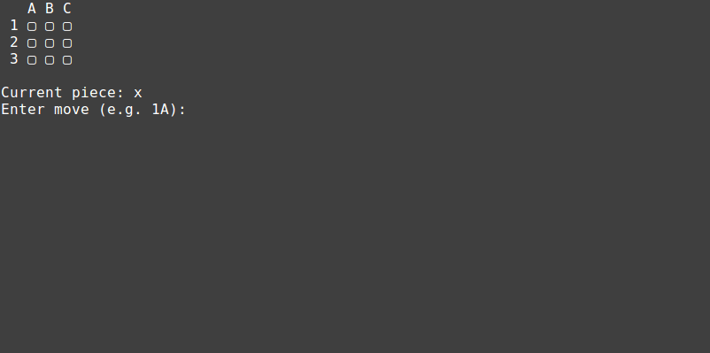

# tic-tac-toe

A fully commented Tic-Tac-Toe example written in the [Rust Programming
Language][rust-lang]. The comments explain some of the syntax and describe a lot
of the decisions that went into creating the program. For a more complete
introduction to the language, see the [Getting Help](#getting-help) section
below.

The code is intentionally kept very simple. You do not need to learn or use
absolutely every feature of Rust in order to productively write software using
it.

Start reading from either `src/main.rs` or `src/game.rs`.

> This project was originally created for a talk:
["An Introduction to Rust"](https://slides.com/sunjay/intro-to-rust/)

## The Game

Tic-Tac-Toe is played on a 3x3 grid. You take turns placing pieces and attempt
to get three in a row horizontally, vertically, or diagonally.

Here's what it looks like when it is running:

## Build Instructions

1. [Install Rust](https://rustup.rs/)
2. [Download](https://github.com/sunjay/tic-tac-toe/archive/master.zip) or
   [clone](https://help.github.com/articles/cloning-a-repository/) the code.
3. Run the command `cargo run` from the project directory

## Getting Help

To start learning the Rust programming language, check out the excellent
[Rust book][book].

The quickest way to get your questions answered is to visit
[The Rust Programming Language Forum][forum]. People there are very helpful and
kind. They will help you figure out whatever you are having trouble with.

## Contributing

[How to Contribute to Open Source](https://opensource.guide/how-to-contribute/)

If you find a typo or want to improve any of the descriptions, please feel free
to make any modifications and then open a [pull request][pr]. A great way to
help out is to clarify anything that I forgot to explain.

Instead of making many unrelated changes in one big pull request, it is often
easier to get several smaller, more focused pull requests reviewed and merged
quickly.

[rust-lang]: https://www.rust-lang.org/
[book]: https://doc.rust-lang.org/book/
[forum]: https://users.rust-lang.org/
[pr]: https://help.github.com/articles/about-pull-requests/
